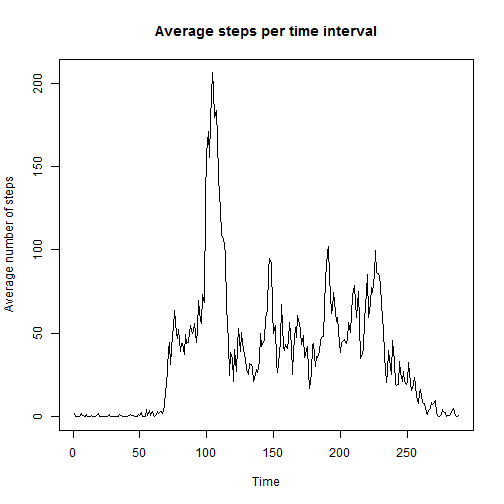

Peer Assessment 1
========================================================

This R Markdown document represents an analysis of of data from a personal activity monitoring device.
This device collects data at 5 minute intervals through out the day. The data consists of two months of data from an anonymous individual collected during the months of October and November, 2012 and include the number of steps taken in 5 minute intervals each day.

## Loading and preprocessing the data  
Lets read the data and store it in activity_DF DataFrame:


```r
setwd("~/Data Science/Reproducible Research/Work")
activity_DF <- read.csv("activity.csv", header = TRUE)
```

## What is mean total number of steps taken per day?  
We start with hitogram of the total number of steps taken each day. At this stage we ignore **NA**


```r
step_by_day = aggregate(steps ~ date, data = activity_DF, FUN=sum)
library(ggplot2)
ggplot(aes(x=date, y=steps), data = step_by_day) +
     geom_bar(stat = 'identity', position = 'dodge',fill="white", colour="darkgreen") +
     theme(axis.text.x = element_text(angle = 90, vjust = 0.5)) +
     labs(y = "Total Steps per Day", title = "Total Steps per day Historgram" )
```

 

Calulating the **MEAN** of daily staps:

```r
a_mean = mean(step_by_day$steps)
a_mean
```

```
## [1] 10766
```

Calulating the **MEDIAN** of daily staps:

```r
a_meadian = median(step_by_day$steps)
a_meadian
```

```
## [1] 10765
```

## What is the average daily activity pattern?
Time series plot (i.e. type = "l") of the 5-minute interval (x-axis) and the average number of steps taken, averaged across all days (y-axis):


```r
step_by_inter = aggregate(steps ~ interval, data = activity_DF, FUN=mean)
plot.ts(step_by_inter$steps , main = "Average steps per time interval", ylab= "Average number of steps")
```

 

The Maximim average steps per inverval is:


```r
step_by_inter[step_by_inter$steps == max(step_by_inter$steps),]
```

```
##     interval steps
## 104      835 206.2
```

## Inputing missing values

Numbers of rows with **NA**


```r
print(c(sum(is.na(activity_DF$steps)),"out of total lines: ",nrow(activity_DF)))
```

```
## [1] "2304"                 "out of total lines: " "17568"
```
Summery of dates with **NA** values:


```r
library(plyr)
temp = ddply(activity_DF,c("date"),summarise,totna =sum(is.na(steps)))
temp[temp$totna > 0,]
```

```
##          date totna
## 1  2012-10-01   288
## 8  2012-10-08   288
## 32 2012-11-01   288
## 35 2012-11-04   288
## 40 2012-11-09   288
## 41 2012-11-10   288
## 45 2012-11-14   288
## 61 2012-11-30   288
```

Lets fill the **NA** with the mean of steps for that interval:


```r
new_activity_DF=ddply(activity_DF, 
      .(interval), 
      transform, 
      steps=ifelse(is.na(steps), as.integer(mean(steps, na.rm=TRUE)), steps))
```


```r
step_by_day = aggregate(steps ~ date, data = new_activity_DF, FUN=sum)
ggplot(aes(x=date, y=steps), data = step_by_day) +
     geom_bar(stat = 'identity', position = 'dodge',fill="white", colour="darkgreen") +
     theme(axis.text.x = element_text(angle = 90, vjust = 0.5)) +
     labs(y = "Total Steps per Day", title = "Total Steps per day Historgram" )
```

 

Calulating the **MEAN** of daily staps:

```r
b_mean = mean(step_by_day$steps)
print(c(format(b_mean,nsmall=1)))
```

```
## [1] "10749.8"
```

```r
print(c("before cleananing the mean was:",format(a_mean,nsmall=1)))
```

```
## [1] "before cleananing the mean was:" "10766.2"
```

Calulating the **MEDIAN** of daily staps:

```r
b_meadian = median(step_by_day$steps)
print(c(b_meadian))
```

```
## [1] 10641
```

```r
print(c("before cleananing the meadian was:",a_meadian))
```

```
## [1] "before cleananing the meadian was:"
## [2] "10765"
```

## Are there differences in activity patterns between weekdays and weekends?


```r
new_activity_DF$weekday = apply(new_activity_DF,1,function(row) weekdays(as.Date(row[2]),abbreviate = TRUE))
new_activity_DF$week = new_activity_DF$weekday %in% c("Mon","Tue","Wed","Thu","Fri")
new_activity_DF$w_ind[new_activity_DF$week] = "weekday"
new_activity_DF$w_ind[!new_activity_DF$week] = "weekend"
step_by_inter = aggregate(steps ~ w_ind * interval, data = new_activity_DF, FUN=mean)

g <- ggplot(step_by_inter, aes(interval, steps))
g + geom_line() + facet_grid(w_ind~ .) +
    theme(strip.text.y = element_text(size=22, face="bold"),
          strip.background = element_rect(colour="red", fill="#CCCCFF"))
```

 


